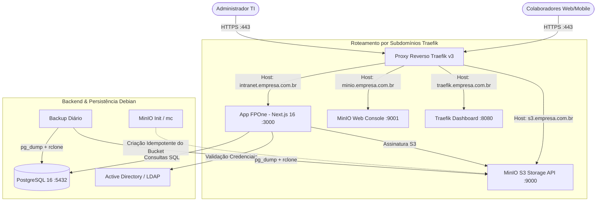

# FPOne Intranet

> Portal corporativo e *Digital Workplace* moderno, modular e seguro para o agronegócio (Fazenda Progresso), conectando colaboradores de escritório e campo (mobile-first).

---

## 1. Visão Geral e Arquitetura Multi-Subdomínio

O **FPOne Intranet** opera de forma 100% autônoma em um **servidor dedicado Debian Linux**, orquestrado via **Docker Compose**, utilizando **MinIO** como motor de armazenamento S3 e **Traefik v3** como proxy reverso inteligente com suporte nativo a múltiplos subdomínios, SSL/TLS automático e dashboard de gerenciamento visual.



---

## 2. Mapa de Subdomínios e Credenciais de Administração

Cada componente da stack possui seu próprio subdomínio dedicado com certificado SSL automático e credenciais administrativas locais independentes:

| Serviço / Componente | Subdomínio Padrão (Variável no `.env`) | Porta Interna | Usuário Local | Senha Padrão / Variável | Finalidade |
|---|---|---|---|---|---|
| **Portal FPOne Intranet** | `APP_DOMAIN`<br>`intranet.fazendaprogresso.com.br` | `web:3000` | `admin` | `Admin@FPOne2026!`<br>(`MASTER_ADMIN_PASSWORD`) | Portal corporativo com acesso a todas as 17 permissões do sistema |
| **API S3 / Arquivos** | `S3_DOMAIN`<br>`s3.fazendaprogresso.com.br` | `minio:9000` | *API S3* | *Chaves geradas* | Download e upload de documentos pré-assinados |
| **MinIO Web Console** | `MINIO_CONSOLE_DOMAIN`<br>`minio.fazendaprogresso.com.br` | `minio:9001` | `admin` | `Admin@FPOne2026!`<br>(`MINIO_ROOT_PASSWORD`) | Console gráfico para gestão de buckets, arquivos e cotas S3 |
| **Traefik Dashboard** | `TRAEFIK_DOMAIN`<br>`traefik.fazendaprogresso.com.br` | `api@internal` | `admin` | `Admin@FPOne2026!`<br>(`TRAEFIK_BASIC_AUTH`) | Painel visual de rotas, middlewares e certificados SSL |
| **Banco PostgreSQL** | `db` (rede interna Docker) | `db:5432` | `fpone` | Definida em `.env`<br>(`POSTGRES_PASSWORD`) | Banco relacional |

---

## 3. Guia Passo a Passo: Configuração e Alteração de Subdomínios

### Passo 1: Apontar as Entradas no seu Provedor de DNS

No seu painel de DNS (Cloudflare, Registro.br, AWS Route53 ou DNS do Windows Server / Active Directory), crie os apontamentos direcionando para o **IP público/privado do seu servidor Debian Linux**:

#### Opção A: Entradas Individuais (Tipo A)
* `intranet.fazendaprogresso.com.br` ➔ `IP_DO_SERVIDOR`
* `s3.fazendaprogresso.com.br` ➔ `IP_DO_SERVIDOR`
* `minio.fazendaprogresso.com.br` ➔ `IP_DO_SERVIDOR`
* `traefik.fazendaprogresso.com.br` ➔ `IP_DO_SERVIDOR`

#### Opção B: Entrada Curinga (Wildcard - Mais Fácil)
* `*.fazendaprogresso.com.br` ➔ `IP_DO_SERVIDOR`

> 💡 **Dica para Testes Locais sem Domínio Registrado**:
> Você pode usar o serviço gratuito de wildcard DNS **`nip.io`**. Basta usar o IP do servidor Debian na URL:
> * `intranet.192.168.77.100.nip.io`
> * `s3.192.168.77.100.nip.io`
> * `minio.192.168.77.100.nip.io`
> * `traefik.192.168.77.100.nip.io`

---

### Passo 2: Configurar os Subdomínios no Arquivo `.env`

No servidor Debian, edite o arquivo `/opt/fpone/.env`:

```bash
nano /opt/fpone/.env
```

Configure a seção de subdomínios conforme seu domínio corporativo:

```ini
# ==============================================================================
# 1. Configuração dos 4 Subdomínios
# ==============================================================================
APP_DOMAIN=intranet.fazendaprogresso.com.br
S3_DOMAIN=s3.fazendaprogresso.com.br
MINIO_CONSOLE_DOMAIN=minio.fazendaprogresso.com.br
TRAEFIK_DOMAIN=traefik.fazendaprogresso.com.br

# E-mail para emissão automática de certificados SSL (Let's Encrypt / ZeroSSL)
ACME_EMAIL=admin@fazendaprogresso.com.br

# URLs públicas da aplicação e storage
AUTH_URL=https://intranet.fazendaprogresso.com.br
S3_PUBLIC_URL=https://s3.fazendaprogresso.com.br
```

---

### Passo 3: Como Alterar Qualquer Subdomínio

Para alterar o nome de qualquer subdomínio (por exemplo, mudar `intranet.` para `portal.` ou `s3.` para `arquivos.`):

1. Edite o `.env`:
   ```bash
   nano /opt/fpone/.env
   ```
2. Modifique a linha correspondente:
   ```ini
   APP_DOMAIN=portal.fazendaprogresso.com.br
   AUTH_URL=https://portal.fazendaprogresso.com.br
   ```
3. Aplique as mudanças no Docker Compose (o Traefik recarrega sem derrubar a aplicação):
   ```bash
   docker compose up -d
   ```
4. O Traefik detecta a nova label imediatamente, solicita o novo certificado SSL ao Let's Encrypt e começa a responder no novo subdomínio em poucos segundos!

---

### Passo 4: Como Funciona a Emissão Automática de SSL/TLS (HTTPS)

O Traefik v3 é o único serviço que escuta nas portas `80` (HTTP) e `443` (HTTPS):
1. Quando uma requisição chega em `https://intranet.suaempresa.com.br`, o Traefik intercepta pelo SNI do TLS.
2. Se for o primeiro acesso, o Traefik usa o desafio HTTP-01 ou TLS-ALPN na porta 80/443 contra o Let's Encrypt.
3. O certificado é emitido, gravado no volume persistente `traefik-certificates` (`/letsencrypt/acme.json`) e renovado automaticamente 30 dias antes de expirar.

---

### Passo 5: Como Adicionar um Novo Subdomínio ou Serviço no `compose.yaml`

Caso queira adicionar um novo serviço no futuro (ex: `docs.fazendaprogresso.com.br`):
Basta adicionar as seguintes labels no serviço dentro do `compose.yaml`:

```yaml
    labels:
      - "traefik.enable=true"
      # Roteador HTTP
      - "traefik.http.routers.meuservico-http.rule=Host(`docs.fazendaprogresso.com.br`)"
      - "traefik.http.routers.meuservico-http.entrypoints=web"
      - "traefik.http.routers.meuservico-http.service=meuservico"
      # Roteador HTTPS com SSL automático
      - "traefik.http.routers.meuservico-https.rule=Host(`docs.fazendaprogresso.com.br`)"
      - "traefik.http.routers.meuservico-https.entrypoints=websecure"
      - "traefik.http.routers.meuservico-https.tls=true"
      - "traefik.http.routers.meuservico-https.tls.certresolver=letsencrypt"
      - "traefik.http.routers.meuservico-https.service=meuservico"
      # Porta interna do container
      - "traefik.http.services.meuservico.loadbalancer.server.port=80"
```

---

## 4. Instalação e Inicialização no Servidor Debian Linux

### Método A: Instalação Automatizada (Recomendado)

```bash
# 1. No servidor Debian, clone o repositório
git clone https://github.com/Kadu325/FPOne.git /opt/fpone
cd /opt/fpone

# 2. Execute o instalador automatizado
sudo bash scripts/setup-debian.sh
```

---

### Método B: Instalação Manual

```bash
# 1. Instalar Docker oficial no Debian
sudo apt-get update -y && sudo apt-get install -y ca-certificates curl gnupg git openssl ufw
sudo install -m 0755 -d /etc/apt/keyrings
curl -fsSL https://download.docker.com/linux/debian/gpg | sudo gpg --dearmor -o /etc/apt/keyrings/docker.gpg --yes
sudo chmod a+r /etc/apt/keyrings/docker.gpg

echo "deb [arch=$(dpkg --print-architecture) signed-by=/etc/apt/keyrings/docker.gpg] https://download.docker.com/linux/debian $(. /etc/os-release && echo "$VERSION_CODENAME") stable" | sudo tee /etc/apt/sources.list.d/docker.list > /dev/null
sudo apt-get update -y && sudo apt-get install -y docker-ce docker-ce-cli containerd.io docker-buildx-plugin docker-compose-plugin
sudo systemctl enable --now docker

# 2. Liberar portas no Firewall
sudo ufw allow 22/tcp    # SSH
sudo ufw allow 80/tcp    # HTTP (Traefik)
sudo ufw allow 443/tcp   # HTTPS (Traefik)
sudo ufw reload

# 3. Configurar .env
cp .env.example .env
sed -i "s|AUTH_SECRET=.*|AUTH_SECRET=$(openssl rand -hex 32)|g" .env
sed -i "s|CPF_PEPPER=.*|CPF_PEPPER=$(openssl rand -hex 32)|g" .env
nano .env  # Preencha seus subdomínios e senhas

# 4. Subir a stack
docker compose up -d --build
```

---

## 5. Gerenciamento e Operação da Stack

### Verificar o Status dos Serviços
```bash
docker compose ps
```

### Visualizar Logs em Tempo Real
```bash
# Todos os serviços
docker compose logs -f

# Apenas a aplicação Web
docker compose logs -f web

# Apenas o Proxy Traefik
docker compose logs -f proxy

# Apenas o Storage MinIO
docker compose logs -f minio
```

### Reiniciar ou Atualizar a Aplicação
```bash
# Atualizar código via Git e recriar o container web
git pull origin main
docker compose up -d --build web
```

### Operações Administrativas via Profile `tools`
```bash
# Aplicar novas migrações Prisma
docker compose run --rm tools npm run db:deploy

# Promover um colaborador por matrícula a Administrador
docker compose run --rm tools npm run admin:bootstrap -- --matricula 000123

# Executar backup imediatamente sob demanda
docker compose exec backup /backup.sh --now
```

---

## 6. Desenvolvimento e Validação Local

```bash
# Instalar dependências
npm.cmd install

# Gerar cliente Prisma
npx.cmd prisma generate

# Executar bateria de 255 testes automatizados (100% de sucesso)
npm.cmd test

# Validar tipagem estrita com TypeScript
npm.cmd run typecheck

# Iniciar servidor local
npm.cmd run dev
```

---

## 7. Licença e Uso
Uso interno corporativo — Projeto FPOne Intranet (Fazenda Progresso).
